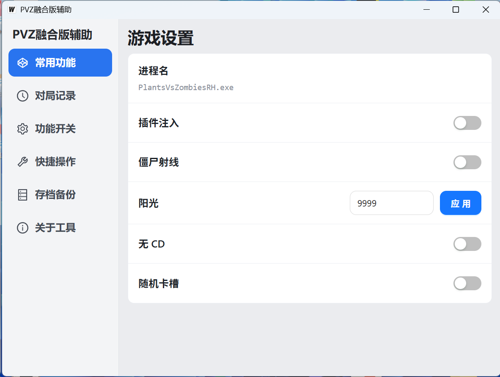

# PVZ 融合版辅助（pvz_rh_hack）

基于 Wails 3 + React + Go + C++ DLL 的桌面辅助工具，面向 `PlantsVsZombiesRH.exe`。  
核心链路是：前端操作 -> Go 服务 -> 注入 DLL -> 命名管道 RPC -> 游戏内功能执行。

## 项目图片




## 功能概览

- 一键注入 / 卸载 DLL
- 修改阳光数值（`SetSun`）
- 功能开关（`SetFreeCD`、`SetRandomCard`）
- 读取僵尸坐标并在透明悬浮窗绘制射线
- 支持将 `payload` 目录内 DLL 内置到 EXE，运行时自动释放到缓存目录并注入

## 技术架构

- 前端：React + TypeScript + Ant Design（`frontend/`）
- 桌面容器：Wails v3（主窗 + `zombie-overlay` 透明窗口）
- 后端：Go（进程管理、窗口同步、DLL 注入、IPC 客户端）
- Native：C++ DLL（命名管道 `\\\\.\\pipe\\PVZModPipe`，处理游戏逻辑 RPC）

## 环境要求

- Windows 10/11（当前核心能力仅 Windows 可用）
- Go `1.25`
- Node.js `18+` 与 npm
- Wails CLI（`wails3`）
- 可选：Visual Studio 2022（需要自行编译 `dll/` 时）

## 快速开始

### 1) 安装依赖

```bash
cd frontend
npm install
cd ..
```

### 2) 开发运行

```bash
wails3 task dev
```

或

```bash
wails3 dev -config ./build/config.yml -port 9245
```

### 3) 构建

```bash
wails3 task build
```

构建产物默认在 `bin/pvz_rh_hack.exe`。

## DLL 与 payload 说明

### 使用内置 DLL

- 构建时会打包 `payload/*.dll`
- 注入时若前端未传入路径，会自动释放内置 DLL 到用户缓存目录后再注入
- 推荐名称：`payload/MyDLL.dll`（代码中优先读取该文件）

### 重新编译 DLL（可选）

1. 使用 Visual Studio 打开 `dll/MyDLL.sln`
2. 编译 `x64 Release`
3. 将产物覆盖到 `payload/MyDLL.dll`
4. 重新执行构建

## 当前暴露的 RPC 方法

- `SetFreeCD(bool)`
- `SetRandomCard(bool)`
- `GetFreeCD()`
- `SetSun(int32)`
- `GetSun()`
- `GetZombiePositions()`（返回 JSON 字符串）

## 目录结构

```text
.
├─frontend/                 # React 前端
├─dll/                      # C++ DLL 工程与源码
├─payload/                  # 待嵌入的 DLL
├─main.go                   # Wails 应用入口
├─processservice.go         # 服务层与 Invoke 编解码
├─process_service_windows.go# Windows 注入/进程/窗口实现
└─embedded_dll_windows.go   # 内置 DLL 释放逻辑
```

## 注意事项

- 本项目的进程名当前固定为 `PlantsVsZombiesRH.exe`。
- 前端默认 `isDebug = true`，会优先使用绝对路径 `D:/Application/Code/Wails/pvz_rh_hack/payload/MyDLL.dll`；发布前建议改为 `false` 以走内置 DLL 流程。
- 命名管道命令载荷上限为 256 字节（见 Go/C++ 双端定义）。
- 涉及注入与内存操作，请仅用于合法、授权的本地测试场景。
